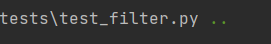

# 2023Fall-ECE444-Group14
<a name="readme-top"></a>
<!-- TABLE OF CONTENTS -->
## Table of Contents
<details>
  <summary>Table of Contents</summary>
  <ol>
    <li>
      <a href="#about-the-project">About The Project</a>
      <ul>
        <li><a href="#built-with">Built With</a></li>
      </ul>
    </li>
    <li>
      <a href="#getting-started">Getting Started</a>
      <ul>
        <li><a href="#prerequisites">Prerequisites</a></li>
        <li><a href="#installation">Installation</a></li>
      </ul>
    </li>
    <li><a href="#usage">Usage</a></li>
    <li><a href="#project-management">Project Management</a></li>
    <li><a href="#contact">Contact</a></li>
    <li><a href="#acknowledgments">Acknowledgments</a></li>
  </ol>
</details>

<!-- ABOUT THE PROJECT -->
## About The Project

This project is the course project of ECE444 Software Development at the University of Toronto, Fall 2023. The goal of this project is to develop a centralized dashboard for University of Toronto, serving as a platform that consolidates all club events and related information. This will be achieved by adapting the club event planning information and building an intuitive clear user interface for the students to access the above information. The primary benefit of the system is to ensure individuals stay informed about current activities and specify their attendances so that students do not miss out on interesting events.   


<p align="right">(<a href="#readme-top">back to top</a>)</p>


### Built With

Our project 

* Python 3
* Flask
* Docker
* HTML

<p align="right">(<a href="#readme-top">back to top</a>)</p>


<!-- GETTING STARTED -->
## Getting Started

This part shows how to get a local copy up and running follow the below steps.

### Prerequisites

* flask
  ```sh
  pip install flask
  ```
* Docker
  ```sh
  install from https://docs.docker.com/engine/install/
  ```

### Installation

1. Clone the repo
   ```sh
   git clone https://github.com/lyfuuoo/Group14-5-Guys.git
   ```

<p align="right">(<a href="#readme-top">back to top</a>)</p>


<!-- USAGE EXAMPLES -->
## Usage

This web application is designed for the University of Toronto Students and Club leaders to use

<p align="right">(<a href="#readme-top">back to top</a>)</p>


<!-- Project Management -->
## Project Management

We will be using Jira for our project tracking and management. The Jira backlog is unfortunatly private only in our Jira basic version, thus, it will be for our internal usage only

<p align="right">(<a href="#readme-top">back to top</a>)</p>


<!-- CONTACT -->
## Contact

Yun Ru - uu.ru@mail.utoronto.ca
Project Link: (https://github.com/lyfuuoo/Group14-5-Guys/)

<p align="right">(<a href="#readme-top">back to top</a>)</p>


<!-- ACKNOWLEDGMENTS -->
## Acknowledgments

Use this space to list resources you find helpful and would like to give credit to. I've included a few of my favorites to kick things off!

* Best Readme Template: (https://github.com/othneildrew/Best-README-Template)

<p align="right">(<a href="#readme-top">back to top</a>)</p>


<!-- MARKDOWN LINKS & IMAGES -->

## Test
Yun Ru write two test functions for login function. 


Yihang Wrote two test function for filter function
